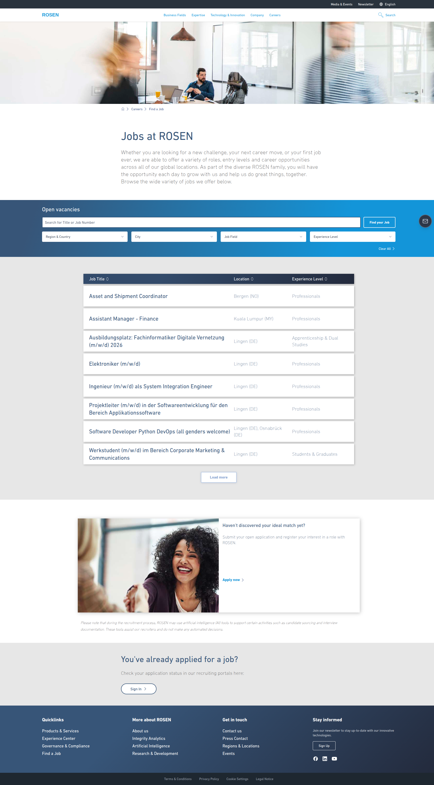

# ROSEN Careers Page Clone


A pixel-perfect recreation of the [ROSEN Group careers page](https://www.rosen-group.com/en/careers/find-a-job), built with modern React best practices and production-grade architecture.

## Live Demo

**[https://rosen-clone.vercel.app/](https://rosen-clone.vercel.app/)**



## Lighthouse Scores

| Performance | Accessibility | Best Practices | SEO |
|:-----------:|:-------------:|:--------------:|:---:|
| 97 | 84 | 100 | 100 |

## Why This Project?

This clone demonstrates my ability to:

- **Reverse-engineer complex UIs** - Matched the original site pixel-by-pixel using Playwright computed style extraction
- **Apply modern architecture patterns** - Atomic Design, separation of concerns, reusable components
- **Use cutting-edge tooling** - React 19, Vite 7, Tailwind CSS 4, TanStack Router, Motion
- **Write maintainable code** - All components under 100 lines, DRY principles, proper TypeScript typing
- **Optimize for performance** - 97 Lighthouse performance score, ~2s production builds
- **Implement i18n** - Full German/English language support with react-i18next
- **Add smooth animations** - Motion (Framer Motion) for micro-interactions and page transitions
- **Write comprehensive tests** - 18 unit tests with Vitest + React Testing Library

## Tech Stack

| Technology | Version | Purpose |
|------------|---------|---------|
| React | 19 | UI library with latest features |
| TypeScript | 5.9 | Type-safe development |
| Vite | 7.3 | Lightning-fast builds |
| Tailwind CSS | 4.1 | Utility-first styling |
| TanStack Router | 1.141 | Type-safe file-based routing |
| i18next | 25.7 | Internationalization (EN/DE) |
| Motion | 12.23 | Smooth animations |
| Vitest | 4.0 | Unit testing |
| Bun | latest | Fast package manager & runtime |

## Architecture Highlights

### Atomic Design Pattern

```
src/
├── components/
│   ├── icons/           # Atoms - Reusable SVG icons
│   │   ├── ChevronRight.tsx
│   │   ├── ChevronDown.tsx
│   │   ├── SortIcon.tsx
│   │   └── index.ts
│   ├── ui/              # Atoms - Base UI components
│   │   ├── Select.tsx
│   │   ├── LanguageSwitcher.tsx
│   │   ├── AnimatedList.tsx
│   │   └── index.ts
│   ├── home/            # Organisms - Page sections
│   │   ├── JobSearch.tsx
│   │   ├── JobList.tsx
│   │   └── ...
│   └── layout/          # Organisms - App shell
│       ├── Header.tsx
│       └── Footer.tsx
├── constants/           # Data layer (separated from UI)
├── lib/                 # Core utilities
│   └── i18n.ts          # i18n configuration
├── test/                # Test setup
└── routes/              # Pages (TanStack Router)
```

### Code Quality Metrics

- **0 TypeScript errors** - Strict mode enabled
- **0 ESLint warnings** - Clean codebase
- **18 unit tests passing** - Components, utilities, and data
- **<100 lines per component** - Easy to read and maintain
- **Reusable Select atom** - Used 4x, written once
- **Full i18n coverage** - All UI strings translatable

## Features

- Job search with multi-filter support (region, city, job field, experience)
- Sortable job listings table with ascending/descending toggle
- Fully responsive layout (mobile, tablet, desktop)
- **Language toggle** - Switch between English and German
- **Smooth animations** - Staggered list animations, hover effects, mobile menu transitions
- CSS architecture using BEM naming in Tailwind `@layer components`
- Accessibility-friendly form controls

## Quick Start

```bash
# Install dependencies
bun install

# Start dev server
bun run dev

# Build for production
bun run build

# Run tests
bun run test

# Full validation (types + lint + build)
bun run validate
```

## CSS Architecture

Custom styles use BEM methodology within Tailwind's layer system:

```css
@layer components {
  .job-list__header { /* ... */ }
  .job-list__row { /* ... */ }
  .search__input { /* ... */ }
}
```

This approach combines Tailwind's utility classes with semantic BEM naming for complex components.

## What I'd Improve Next

Given more time, I would:

- **Add API integration** - Replace static job data with real ROSEN API calls
- **Implement search functionality** - Connect filters to actual job filtering logic
- **Improve accessibility** - Target 95+ Lighthouse accessibility score
- **Add E2E tests** - Playwright for critical user flows
- **Server-side rendering** - Next.js or TanStack Start for SEO optimization

## Scripts

| Command | Description |
|---------|-------------|
| `bun run dev` | Start dev server (port 5175) |
| `bun run build` | Production build |
| `bun run test` | Run unit tests |
| `bun run test:watch` | Run tests in watch mode |
| `bun run validate` | Type check + lint + build |
| `bun run reset` | Clean install |

## License

MIT
